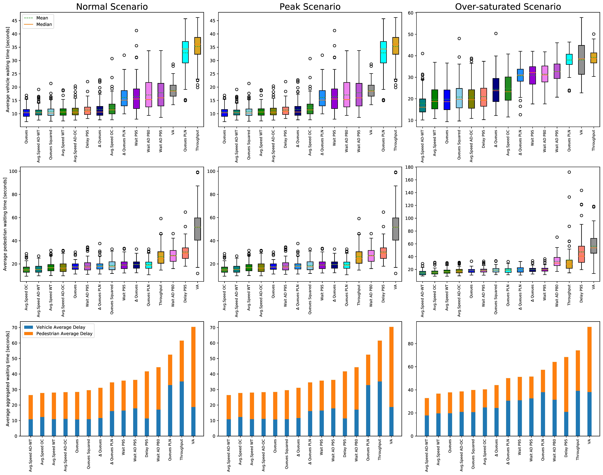
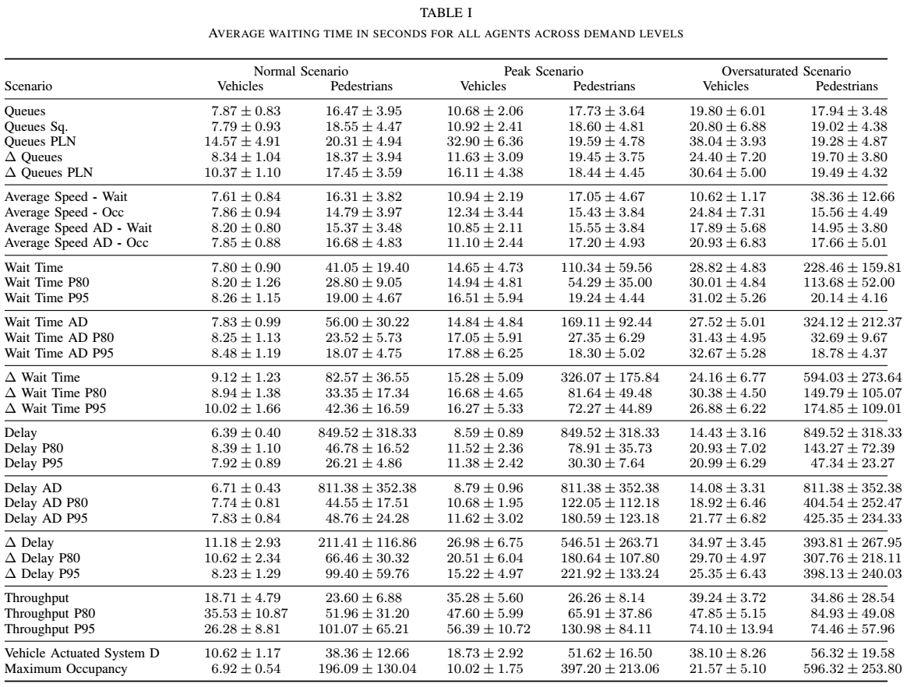

# Assessment of Reward Functions in Reinforcement Learning for Multi-Modal Urban Traffic Control under Real-World limitations
This repository contains a pre-print version of the paper titled above, submitted to IEEE Systems, Man and Cybernetics 2020 (SMC2020), for private distribution and version control.
All intellectual property here contained belongs to Alvaro Cabrejas Egea, the Mathematics for Real-World Systems Centre for Doctoral Training (University of Warwick), The Alan Turing Institute and IEEE.

## Abstract
Optimisation of Traffic Signal Control Systems is an important real-world challenge that has direct impact on the economy and quality of life of urban areas.Recently, Reinforcement Learning is proving to be a successful tool that can effectively manage urban intersections with a fraction of the effort required to curate traditional Urban Traffic Controllers. 

This paper adds on the authors' previous work, performing a robust comparison between 30 different Reinforcement Learning reward functions for controlling intersections serving vehicles and pedestrians. We use a calibrated model in terms of demand, sensors, green times and other operational constraints of a real intersection in Greater Manchester, UK. 
Sensory inputs are restricted to what can be achieved with current vision-based sensors, such as those from Vivacity Labs.
The rewards can be broadly classified in 5 groups depending on the magnitudes used: queues, waiting time, delay, average speed and throughput in the junction. The performance of different agents, in terms of waiting time, is compared across different demand levels ranging from normal operation to saturation of traditional adaptive controllers.

We find that those rewards maximising the speed of the network obtain the lowest waiting time for vehicles and pedestrians simultaneously, closely followed by queue minimisation, demonstrating better performance than other methods proposed in the literature.

## Results

